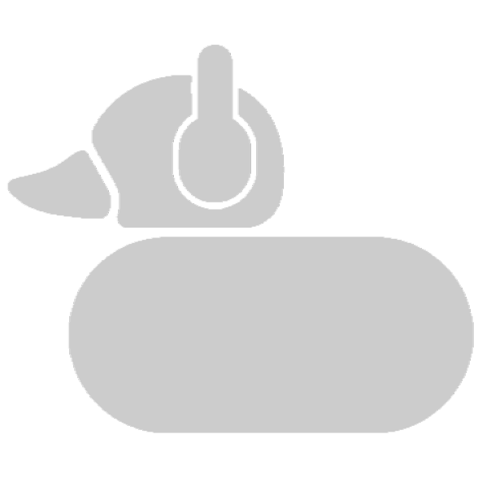

<h1 align="center">
  
  <br>GUA Player
</h1>

<p align="center">
  <strong>一款使用輕量級、支援全域快捷鍵的跨平台音樂播放器</strong>
</p>

<p align="center">
  <a href="https://github.com/Z1per-36/--GUA-music-player/releases/latest">📦 下載最新版本 (Windows / macOS / Linux)</a>
</p>

---

## ✨ 核心特色

- 🎵 **多平台支援**：完美整合 YouTube Music、Spotify、SoundCloud。
- 💻 **本機音樂播放**：不僅能聽串流，也完全支援播放本機電腦上的音樂檔案。
- ⌨️ **全域快捷鍵**：讓你在打遊戲、寫寫程式時，不需要切換視窗就能直接控制「上一首/播放/暫停/下一首」。
- 🪟 **現代化介面**：Windows 11 風格的半透明毛玻璃介面設計（Mica 效果支援）。
- 🔋 **記憶體最佳化**：未使用到的平台會主動休眠釋放資源，確保背景執行時依然輕量、零負擔。

## 🚀 快速安裝與使用

### 下載安裝

本工具適用於 **Windows**、**macOS** 與 **Linux** 系統！你不需要透過繁瑣的指令編譯，請直接到 Release 區下載自動幫你打包好的檔案：

1. 前往專案的 **[Releases 頁面](https://github.com/Z1per-36/--GUA-music-player/releases)**。
2. 根據您的作業系統下載對應檔案：
   - 🪟 **Windows**: 下載 `.exe` 安裝檔。
   - 🍎 **macOS**: 下載 `.dmg` 檔案。
   - 🐧 **Linux**: 下載 `.AppImage` 檔案。
3. 執行安裝或直接開啟。

### 全域快捷鍵預設設定

預設包含以下操作，你隨時可到程式右下角的「⚙️ 設定」修改：
- 播放 / 暫停：`CommandOrControl + Alt + Space`
- 下一首：`CommandOrControl + Alt + Right`
- 上一首：`CommandOrControl + Alt + Left`

## 🛠 給開發者的編譯指南

如果您想自己修改原始碼或手動編譯：

**環境準備：** 需要安裝 [Node.js](https://nodejs.org/) (建議 v18 以上)。

1. **複製專案：**
   ```bash
   git clone https://github.com/Z1per-36/--GUA-music-player.git
   cd --GUA-music-player
   ```

2. **安裝依賴包：**
   ```bash
   npm install
   ```

3. **開發模式啟動：**
   ```bash
   npm start
   ```

4. **手動本機打包：**
   ```bash
   npm run dist
   ```
   > 產出的安裝檔會存放在 `dist` 資料夾內。

## ⚙️ 技術架構

- **[Electron](https://www.electronjs.org/)**: 作為跨平台桌面應用的核心引擎。
- **純生 JavaScript & CSS**: 堅持不使用肥大的前端框架，追求最輕量、極限的執行效能。
- **Electron Builder**: 用於提供一鍵式的跨系統安裝包生成。

## 💖 授權條款

本專案採用 ISC 授權。歡迎自由使用與參與貢獻！
